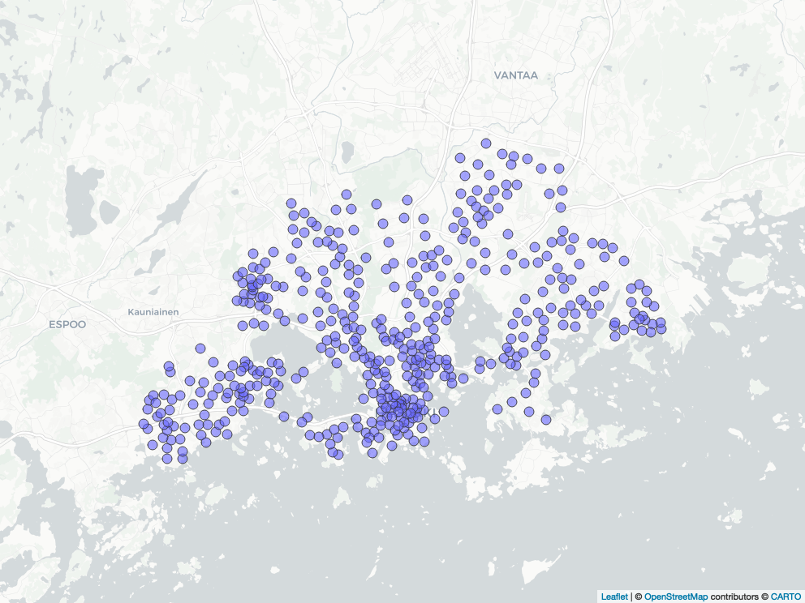

$$\\[0.1in]$$

```{r setup, include=FALSE}
knitr::opts_chunk$set(comment = "#>", echo = FALSE, fig.width = 6, cache = TRUE)
```

### Data overview and introduction

This project will use the open access origin-destination (OD) Helsinki Bike Sharing System (BSS) dataset to perform analyses on bike sharing trips in Helsinki, Finland. This is a valuable dataset available from the [Open data of the city of Helsinki](https://www.hsl.fi/en/hsl/open-data#journeys-made-by-city-bikes), as it documents real-time movements between stations, thus the structure of the bike network can be revealed through the flow of people. Journeys in this extract of the data occurred between April 1st - May 12th 2021, of which there are just under 550k flows in the raw dataset. As cycling offers a sustainable and economic alternative transport medium to both public transport and private car-use, studies analysing the determinants of cycle uptake provide indicators of how cities can implement appropriate policies, infrastructure and bike-share capacities to promote cycling as a mode of transportation [@doi:10.1080/01441640903187001]. The code, data and R Markdown files to run this project are contained in the Github repository [helsinkiBSS](https://github.com/elliemarfleet/helsinkiBSS) to aid reproducible analysis.

In addition to the bike share dataset, the associated docking locations of bike stations across Helsinki and Espoo can be found [here](https://hri.fi/data/en/dataset/hsl-n-kaupunkipyoraasemat).
This file contains the associated geometries of the station locations. 


```{r, echo=FALSE, results='hide', message=FALSE, warning=FALSE}
# load the bikeshare and docking locations datasets and show a glimpse 
library(webshot)
library(sf)
library(readr)
bikes <- read_csv("helsinki_data/bikes_helsinki.csv")
docking_loc <- st_read("helsinki_data/bikestations/Helsinki_Espoo_kaupunkipyöräasemat_2021.shp")
```

```{r, eval = FALSE}
summary(bikes)
```

```{r, echo=FALSE, eval = FALSE}
# then plot
library(mapview)
mapviewOptions(fgb = FALSE)
map1 <- mapview(docking_loc$geometry)
mapview::mapshot(map1, file = "dockingstations.png")
```

<center>
{width=500px}
</center>
*Figure 1: Docking station locations across Helsinki*
$$\\[0.1in]$$

As part of the exploratory data analysis, demographic data at postal level was downloaded for the wider metropolitan area from [Tilastoksus](https://pxnet2.stat.fi/PXWeb/pxweb/en/Postinumeroalueittainen_avoin_tieto/Postinumeroalueittainen_avoin_tieto__2022/paavo_pxt_12ey.px/) (Finland's Statistical Database) for the year 2020; the latest publication year of the data at the time of writing. Variables were transformed into percentages to make them more meaningful. The primary variables used are listed below.


**Variables extracted, by postal sector**:

* Total population,
* % females / % males,
* % over 18 with university degree,
* average income of inhabitants,
* % in the highest income bracket,
* % in the lowest income bracket,
* % in each age group

The spatial geometry of the postal level boundary data is evidenced below. As this study assesses the Helsinki BSS in which flows can only occur between stations, the boundary file was clipped using QGIS' feature `Select by location` to only accommodate for postal sectors in which a docking station resides. Although this excludes external areas to the BSS who may require improved accessibility to sustainable transport modes, this is outside the scope of this study as the OD pairs are the primary focus here, of which none originate or end in the outer postal sectors due to lack of docking stations.

<center>
{width=500px}
</center>
*Figure 2: Helsinki postal sectors boundaries, clipped to docking stations*
$$\\[0.1in]$$

#### Research questions
Three primary research questions were formulated to guide the structure and aim of the project, building upon previous works and enabling a means of providing policy recommendations as an outcome of the project. These include;

1. Which areas possess the largest proportion of flows originating from and arriving to, and what is the most frequented OD pair? How do these patterns vary temporally?
2. What is the relationship between demographic factors such as gender, age, income, education level and frequency of trips. Is there a positive correlation between typically male dominated, higher-income areas and more trips as the literature suggests? i.e. is usage of the BSS in Helsinki equal?
3. Can demand at stations in a given month be predicted using linear and/or machine learning approaches? if so, what are the most important variables that contribute to the prediction?

$$\\[0.1in]$$

#### Previous studies

Previous works have focused on analysing who the primary users of BSS schemes are, factors identified include younger adults, those of higher-income and males; characteristics that are generally reflective of overall cycle use [@doi:10.1080/01441647.2013.775612]. Recent studies have noted how "most BSS typically benefit the privileged" (p. 401), and that schemes generally are more accessible to higher socio-economic groups [@de2019contradictions]. @wrro154363 however found in analyses of the London Cycle Hire Scheme (LCHS) that cycle hire usage was not lower in lower income areas, and question whether future studies will find further evidence of other cities exhibiting similar trends in equal distribution, or whether London will be an exception. This study will build upon this work, through a spatial analysis of Helsinki's demographic composition alongside the bikeshare data, as @MORTON2018102 highlights the importance of understanding the socio-demographic make-up of BSS users to support policy and decision making. Although the bikeshare data does not possess attributable characteristics to the population (e.g. age, gender, income) due to privacy controls, the aggregation of proportions of such groups accessible through national statistics provides a useful means of analysis.


$$\\[0.5in]$$

### Methodology

#### Missing values and outliers

The three datasets were checked for missing values using the `is.na` function. Only the bikes dataset was found to have missing values, in which 741 values were missing from the distance column and were thus imputed with the median distance across the flows. Outliers were similarly removed from the distance column by removing rows which possessed a trip distance which exceeded 60,000m (37.3 miles); given the purpose of the BSS for providing a sustainable mode for shorter trips, and that the span of the study area in which docking locations reside is < 25,000m, trips exceeding this length were categorised as outliers and removed. Trips relating to Station ID 997 (Workshop Helsinki) were also removed as this station lies outside the study area.

```{r, echo=FALSE, results='hide', message=FALSE, warning=FALSE}
is.na(docking_loc)
is.na(demo)
which(is.na(bikes))

bikes$`Covered distance (m)`[is.na(bikes$`Covered distance (m)`)] <- median(bikes$`Covered distance (m)`, na.rm=TRUE)

# recheck there's now no missing values
#which(is.na(bikes))
```


```{r, echo=FALSE}
# remove any rows where the distance is over 80,000m (around 50 miles) 
# code says 80,000 but next largest distance is 55,000 so 60,000+ removed
bikes <- bikes[bikes$`Covered distance (m)`<=80000,]
```
$$\\[0.1in]$$

#### Data cleaning

As the OD bikes dataset has no geometry attached to it and thus cannot be analysed spatially, the [od2line()](https://rdrr.io/cran/stplanr/man/od2line.html) function was implemented to create desire lines between origins and destinations, using the bikes dataset as the flow within the argument and the docking locations dataset as the zones due to it's spatial format. This function created the object `desire_lines_helsinki` with nearly 550k rows.

```{r, message=FALSE, warning=FALSE, echo=FALSE, results='hide'}
# change nimi (finnish word) to something more meaningful (station name)
library(plyr)
library(dplyr)
library(tidyverse)
docking_loc2 <- docking_loc %>%
  rename(station_name = Nimi) %>%
  select(station_name, everything())

# change departure station name to station_name in bikes2
bikes2 <- rename(bikes, "station_name" = "Departure station name")

# move departure station ID column to the front then joining on that and change the reordering of columns
bikes2 <- bikes[, c(3, 5, 4, 6, 1, 2, 7, 8)]
# also move dockingloc so it has departure ID first
docking_loc2 <- docking_loc[, c(2, 1, 3:14)]

# format the ID columns to number
D <- transform(docking_loc2, ID = as.numeric(ID))

# change departure station id to ID
bikes3 <- rename(bikes2, "ID" = "Departure station id")  
bikes3 <- rename(bikes3, "ReturnID" = "Return station id")
# then format column to number 
b <- transform(bikes3, ID = as.numeric(ID))

# the return station ID has 0 in front of it, make that column numeric
b <- transform(b, ReturnID = as.numeric(ReturnID))

# remove return station ID 997 (Workshop Helsinki) as this lies outside the study area
b <- b[b$ReturnID != "997", ]
b <- b[b$ID != "997", ]
```


```{r, echo=TRUE, error=FALSE}
# use od2line to create desire lines between the origins and destinations
desire_lines_helsinki <- stplanr::od2line(flow = b, zones = D)
```

The intra-zonal flows were next removed (point based data in which origins and destinations occur at the same station of which there were just over 36,000). Only the inter-zonal flows (flows between different stations), which have a minimum threshold of 40 were selected to remain.

```{r, message=FALSE, warning=FALSE, results='hide', echo=TRUE}
# filtering of top flows
desire_lines_inter <- desire_lines_helsinki %>% filter(ID != ReturnID)
desire_lines_intra <- desire_lines_helsinki %>% filter(ID == ReturnID)
desire_lines_top <- desire_lines_inter %>% filter(ID >= 40)
```

The `desire_lines_top` object consists of around 400k flows. To continue aggregating, counts for OD pairs were obtained by grouping the dataset to create an additional count column ('n') to document how many times the same OD journey occurred. Aggregated counts for each station were then obtained based on how many trips in total originated and arrived at each station.

```{r, message=FALSE, warning=FALSE, echo=FALSE}
save <- desire_lines_top %>% add_count(ID, ReturnID)
```

```{r, message=FALSE, warning=FALSE, eval = FALSE, echo=FALSE}
# plot this dataset
# import as image so it doesn't have to run everytime
library(tmap)
save <- save %>%
  arrange(n)
dls <- tm_shape(save) +
  tm_lines(
    palette = "plasma", breaks = c(0, 50, 500, 1000, 2285),
    lwd = "n",
    scale = 9,
    title.lwd = "Number of trips",
    alpha = 0.5,
    col = "n",
    title = "Cycling trips",
    legend.lwd.show = FALSE
  ) +
  tm_scale_bar() +
  tm_layout(
    legend.bg.alpha = 0.5,
    legend.bg.color = "white"
  )

tmap_save(dls, "dls.png")
```

$$\\[0.1in]$$

#### QGIS and mapping

The majority of maps created as part of this project were made using QGIS 3.16, alongside the application of other analysis tools provided by QGIS such as `select by location` and `count points in polygon`. QGIS is a free GIS software which can be downloaded to both Windows and Mac [here](https://qgis.org/en/site/forusers/download.html). 

To reproduce any maps created as part of this study, counts of both origin and destination flows for each docking station were aggregated to postal sector level using QGIS' function `count points in polygon` (counting the number of stations within each postal sector, and summing the total origin/destination counts), meaning the proportions of flows originating and ending at each postal sector could be calculated and visualised. With the aggregated data in this new spatial format, the bikes data could be joined to the demographic data using the common variable `Posno` (Postal sector). Maps were then produced by joining `.csv` files exported from R Studio to the clipped postal level boundary file.

$$\\[0.1in]$$

#### Alternative approaches

The OD bikeshare data could have been analysed using alternate approaches to R and QGIS applied within this report. Other programming languages such as python would have also provided an appropriate means to study flows within the region, alongside tools such as KeplerGL to provide interactive visualisations of flows. 

This approach was however not chosen for this study, due to the limited temporal length of the data used, as animated visualisations are often better suited for longer temporal analyses to show change over time. Similarly due to the requirements of this report to be submitted in `.pdf` format, static plots created in R Studio and QGIS were better suited to show the project findings. Data cleaning, joining and general analysis could however have been applied in python without complication, but R Studio and the `tidyverse` approach was selected for interactive data analysis and modelling with the aid of auto-completion of variable names. The benefits of the package `stplanr` were also favoured due to the applications with origin-destination analyses.

Similarly, additional datasets could have been applied and joined to the bikeshare data relating to the demographic and geographical composition of Finland due to the dynamic number of open-access datasets available from [Helsinki Region Infoshare](https://hri.fi/en_gb/), including tourism, health, economic and housing data. Due to the scale of this project, few variables had to be selected and those chosen conformed to those applied within *Previous Studies* - but further attributes could be added in future as an extension of the project.


$$\\[0.2in]$$

### Analysis and results

#### Overall findings

The `desire_lines_top` object was first visualised using `tmap` to analyse all flows within the cleaned dataset.

<center>
{width=700px}
</center>

To understand the flows depicted in *Figure 3*, exploratory data analysis was performed alongside the demographic data. The aggregated flows by both origin station and destination station were assessed to distinguish the most popular pick-up and return stations of bikes. The most common destination (1.7% of top inter-zonal flows) was station ID 30 (Itämerentori), and the most popular origin (1.85% of top inter-zonal flows) was station ID 113 (Pasila railway station). This suggests the Helsinki BSS caters to the last-mile problem (@zellner2016overcoming), as travellers use the bikes for journeys to and from train stations during the final section of their journey.
This aggregation of flows originating from each postal sector was visualised to aid spatial analyses.

```{r, message=FALSE, warning=FALSE, fig.align='center', fig.width=12}
library(cowplot)
library(ggplot2)

i1 <- ggdraw() + draw_image("maps/ori_final.jpeg")
i2 <- ggdraw() + draw_image("maps/popOD.jpeg")

plot_grid(i1, i2)
```
*Figure 4: Most popular origin postal sectors; Figure 5: Most popular OD flow*


Alternatively, the most common OD pairing occurred between origin 541 and destination 547, at Aalto University campus; the highest cluster of flows outlined in *Figure 2*. The second most common OD pair was the opposite direction of travel between the same two stations. OD journeys on this route equate to 1.1% of all journeys within the top inter-zonal flows. The postal sector which contains these stations (sector 2150) does not however possess a high capacity of bikes, as there are 286 bikes available across the 12 stations in this sector. In comparison to more central postal sectors in Helsinki (e.g. sector 100) where there are 21 stations with an accumulated capacity of > 400 bikes; illuminating how increased capacity at exterior stations to the Helsinki central area may be necessary to meet observed demand.


```{r, echo=FALSE, message=FALSE, warning=FALSE, results='hide'}
# import demographic data
demo <- read_csv("all_helsinki_data.csv")

# export the bikes OD layer as a csv so you can wrangle in R
#write.csv(save, "bikesOD.csv")
```

```{r,eval=FALSE, echo=FALSE, message=FALSE, warning=FALSE, results='hide'}
library(plyr)
# how many flows from each origin station
# there are 311 rows - this makes sense as less than station count in area
#origins <- count(save, "ID")
#origins

# percentage of all trips (only the top inter-zonal flows after cleaning that is = 400,554) originating from this origin
#percent_ori <- origins$freq / nrow(save) *100

# destination totals 
# 350 rows here
#destinations <- count(save, "ReturnID")
#destinations
# percentage of all trips travelling to this destination
#percent_dest <- destinations$freq / nrow(save) *100

# forget the formulas they're not working. extract the origins and destination tables and do it in excel
#write.csv(origins, "origincounts.csv")
#write.csv(destinations, "destcounts.csv")

# import the percentage data
#percents <- read_csv("station_percentages.csv")
```

```{r, echo=FALSE, message=FALSE, warning=FALSE, results='hide'}
# import the percentage data
percents <- read_csv("station_percentages.csv")
```


The average departure timestamp for the most frequent OD pair (*Figure 5*) at the university campus is 4:46pm, and the average return time is 4:51pm. This suggests that the purpose of this route is predominantly for commuting purposes or accessing facilities on campus, as opposed to leisure-based trips. Alternatively, within the least common OD pairs (< 100 flows), the average departure time is 9.11pm, and the average return time is 9.44pm. This is representative of the demand for infrequent, leisure based trips that occur outside of stereotypical working hours (9-5pm). 

```{r, eval=FALSE, echo=FALSE, message=FALSE, warning=FALSE, results='hide'}
library(dplyr)
library(lubridate)

# mean of all timestamp origins is 11.15pm
save %>%
  mutate(Depature = hms(Departure)) %>%
  group_by(h = hour(Departure), m = minute(Departure)) %>%
  summarise(Mean = mean(Departure))

# mean (departure) timestamp of only the highest OD pair (uni-directional)
library(dplyr)
save %>%
  filter(n > 2171) %>%
  group_by(ID) %>%
  summarise(mean_ = mean(Departure))

# mean (return) timestamp of only the highest OD pair (uni-directional)
save %>%
  filter(n > 2171) %>%
  group_by(ReturnID) %>%
  summarise(mean_ = mean(Return))

# mean (departure) timestamp of only the lowest OD pairs
save %>%
  filter(n < 100) %>%
  group_by(ID) %>%
  summarise(mean_ = mean(Departure))

# mean (return) timestamp of only the lowest OD pairs
save %>%
  filter(n < 100) %>%
  group_by(ReturnID) %>%
  summarise(mean_ = mean(Return))
```


```{r, echo=FALSE, message=FALSE, warning=FALSE, results='hide'}
# join the demographic data and bikes data together
# demo dataset has "code" which is the postal sector code
# need to add a column to save with the associated postal sec code for each docking station ID

# load in data documenting % counts of origin and dest flows for each postal sector
pos_counts <- read_csv("postal_O_D_counts.csv")

# use group by to get total % counts of flows per postal sector

# counts of origins by postal sec
O <- aggregate(x = pos_counts$ori,                # Specify data column
          by = list(pos_counts$Posno),              # Specify group indicator
          FUN = sum)  

# counts of destinations by postal sec
D <- aggregate(x = pos_counts$dest,                # Specify data column
          by = list(pos_counts$Posno),              # Specify group indicator
          FUN = sum) 

# join O and D
OD_Posnos <- merge(O, D, by = "Group.1")

# rename columns to something more meaningful
names(OD_Posnos)[1] <- "code"
names(OD_Posnos)[2] <- "origins"
names(OD_Posnos)[3] <- "destinations"

# now this dataset can be joined to the demographic data for analysis
demo_linked <- merge(OD_Posnos, demo, by = "code")

# use this dataset for correlation analysis :) matrix, linear regression, etc 
```
$$\\[0.1in]$$

#### Correlation plots

```{r, echo=FALSE, fig.align='center', fig.width=5, fig.height=3}
# distance vs rentals plot
ggplot(save, aes(x = Covered.distance..m., y = n)) + geom_point() + ggtitle("Total OD flows vs distance covered") + theme(plot.title = element_text(hjust = 0.5)) + xlab("Trip distance (m)") + ylab("OD trips") + theme(panel.grid.major = element_blank(), panel.grid.minor = element_blank())
```
*Figure 6: Distance covered vs total flows*


*Figure 6* shows how the largest trip distance surpasses 50km (31 miles). This flow was not considered an outlier as the trip duration and timestamp of the departure and return were plausible at around 4 hours, meaning the average speed of around 8mph. The majority of trips however possess a trip distance < 20km (12.4 miles); illuminating the primary usage of the BSS for providing a short-term, sustainable transport mode in the Helsinki region.


```{r, echo=FALSE}
library(ggplot2)
# correlation analysis with selected demographic variables
# drop insignificant columns
demo_l_drop <- demo_linked[ -c(1, 4, 5, 8, 17, 20, 21, 22) ]
```


```{r, echo=TRUE, fig.align='center'}
# plot correlation matrix with selected demographic variables

library(DataExplorer)
plot_correlation(demo_l_drop, type = 'all', cor_args = list(method = "spearman", 
                                                    use = "pairwise.complete.obs"), 
                 ggtheme = theme_minimal(base_size = 6), na.omit(TRUE))
```


*Figure 7: Correlation analysis between all variables*

Age was found to possess the most significant correlation between the percentage of origin or destination trips a postal sector encountered and the predominant age groups residing with that postal sector. Older age categories (aged 45 and over) possessed a negative correlation with the OD flows, illustrating the reduced likelihood of a flow starting or ending in a postal sector with higher proportions of these age groups. The reverse effect was evident for younger age groups, as age groups between 16-44 possessed a positive correlation with OD flows, illuminating that the BSS is primarily used by younger to middle aged adults.

Proportions of individuals with a degree similarly possessed a positive correlation between OD flows. Gender was also found to possess a correlation between percent male/female in each postal sector, albeit a weaker correlation coefficient to age and degree. However, the correlation analysis does reveal that proportion of males in a postal sector has a positive correlation with flows, whereas proportion of females has a negative correlation. 

Although income was not found to possess a significant correlation between flows, a spatial analysis of residents that fell within the highest income bracket was conducted to assess their proximity to bike stations and the stations associated capacity (*Figure 8*).

<center>
{width=500px}
</center>
*Figure 8: Highest income bracket by postal sector*


Despite stations being clustered in higher-income postal sectors to the southern and western areas of Helsinki as demonstrated by *Figure 8*, it's evident there are stations present within the lower-income areas in the east despite reduced capacities, illuminating how access to the BSS is equal to a certain extent due to the distribution of stations. Network analysis of low-income households to the closest docking station could have been applied to support this analysis but was outside the scope of this study.


$$\\[0.1in]$$


#### Temporal trip segmentation

```{r, echo=FALSE, message=FALSE, warning=FALSE, results='hide', fig.align='center', out.width = '40%'}
# trip segmentation by time of day
library(lubridate)

# transform into date time column 
save$Time_stamp_O <- ymd_hms(save$Departure)
save$Time_stamp_D <- ymd_hms(save$Return)

# create breaks
breaks <- hour(hm("00:00", "6:00", "12:00", "18:00", "23:59"))
# labels for the breaks
labels <- c("Night", "Morning", "Afternoon", "Evening")

save$Time_of_day_O <- cut(x=hour(save$Time_stamp_O), breaks = breaks, labels = labels, include.lowest=TRUE)
save$Time_of_day_D <- cut(x=hour(save$Time_stamp_D), breaks = breaks, labels = labels, include.lowest=TRUE)

# visualise departures across the season
season <- save %>% 
  ggplot(aes(Time_stamp_O)) +
  geom_freqpoly(binwidth = 86400, colour = "aquamarine") +
  xlab("Date trip recorded") + ylab("Proportion of trips") + theme(panel.grid.major = element_blank(), panel.grid.minor = element_blank()) + ggtitle("Frequency of trips over the season") + theme(plot.title = element_text(hjust = 0.5)) # 86400 seconds = 1 day
season
```
*Figure 9: Temporal overview of flows*

Trips across the season fluctuate largely, with the most popular time of travel being in the third week of April which may represent the return to work/school following the easter holidays. The large fluctuation in flows show the difficulty of planning BSS capacities across the year due to the steep declines and inclines in bike usage.

```{r, eval = FALSE, echo=FALSE}
# segment these desire lines by time of day
# rename column n so there's no repeat
names(save)[9] <- "flows"

# select all morning trips
morning <- save %>% filter(Time_of_day_D == "Morning")

# plot the flows column of this dataset
morning <- morning %>%
  arrange(flows)
w1 <- tm_shape(morning) +
  tm_lines(
    palette = "plasma", breaks = c(0, 250, 500, 800, 2285),
    lwd = "flows",
    scale = 9,
    title.lwd = "Number of trips",
    alpha = 0.5,
    col = "flows",
    title = "Morning cycling trips",
    legend.lwd.show = FALSE
  ) +
  tm_scale_bar() +
  tm_layout(
    legend.bg.alpha = 0.5,
    legend.bg.color = "white"
  )

tmap_save(w1, "morning.png")
```

```{r, eval = FALSE, echo=FALSE}
# select all afternoon trips
aft <- save %>% filter(Time_of_day_D == "Afternoon")

# plot the flows column of this dataset
aft <- aft %>%
  arrange(flows)
w2 <- tm_shape(aft) +
  tm_lines(
    palette = "plasma", breaks = c(0, 250, 500, 800, 2285),
    lwd = "flows",
    scale = 9,
    title.lwd = "Number of trips",
    alpha = 0.5,
    col = "flows",
    title = "Afternoon cycling trips",
    legend.lwd.show = FALSE
  ) +
  tm_scale_bar() +
  tm_layout(
    legend.bg.alpha = 0.5,
    legend.bg.color = "white"
  )

tmap_save(w2, "aft.png")
```


```{r, eval = FALSE, echo=FALSE}
# select all evening trips
eve <- save %>% filter(Time_of_day_D == "Evening")

# plot the flows column of this dataset
eve <- eve %>%
  arrange(flows)
w3 <- tm_shape(eve) +
  tm_lines(
    palette = "plasma", breaks = c(0, 250, 500, 800, 2285),
    lwd = "flows",
    scale = 9,
    title.lwd = "Number of trips",
    alpha = 0.5,
    col = "flows",
    title = "Evening cycling trips",
    legend.lwd.show = FALSE
  ) +
  tm_scale_bar() +
  tm_layout(
    legend.bg.alpha = 0.5,
    legend.bg.color = "white"
  )
w3

tmap_save(w3, "evening.png")
```


The most popular time of travel and day of travel within the data were also analysed by calculating the day the trip occurred using the `timestamp` variable and `lubridate` package. The time of day the trip occurred was similarly acquired by creating hour-based breaks within the data (06:00 - 12:00, 12:00 - 18:00, 18:00 - 00:00, 00:00 - 06:00) and subsequently labelling these periods "Morning", "Afternoon", "Evening" and "Night".


```{r, echo=TRUE, message=FALSE, warning=FALSE}
# what day and time of day is most popular for bike travel
# calculate trip proportion not count for meaningfulness and direct comparison
require(ggplot2)
require(scales)

p3 <- save %>% 
  mutate(wday = wday(Time_stamp_O, label = TRUE)) %>% 
  ggplot(aes(x = wday)) +
    geom_bar(aes(y = (..count..)/sum(..count..)),fill="aquamarine3") + scale_y_continuous(labels=percent) + xlab("Day") + ylab("Total trips count") + theme(panel.grid.major = element_blank(), panel.grid.minor = element_blank()) + ggtitle("Most popular day of travel") + theme(plot.title = element_text(hjust = 0.5))
```


```{r, echo=FALSE, message=FALSE, warning=FALSE, results='hide'}
## ggplot bar chart 
#ggplot(data = save) + geom_bar(mapping = aes(x = Time_of_day_O), stat = "count")

plt <- ggplot(data = save) +
  geom_bar(mapping = aes(x = Time_of_day_O, group = 1))
plt_b <- ggplot_build(plt)
plt_b$data[[1]]

p1 <- ggplot(data = save) + 
  geom_bar(mapping = aes(x = Time_of_day_O, y = ..prop.., group = 1), stat = "count", fill="aquamarine3") + 
  scale_y_continuous(labels = scales::percent_format()) +
  xlab("Time of day") + ylab("Proportion of trips") + theme(panel.grid.major = element_blank(), panel.grid.minor = element_blank()) + ggtitle("Most popular time of day of travel") + theme(plot.title = element_text(hjust = 0.5))

```

```{r, echo=FALSE, out.width='.49\\linewidth', fig.width=7, fig.height=3,fig.show='hold',fig.align='center', warning=FALSE, message=FALSE}
# plot the 2 next to eachother
library(gridExtra)
grid.arrange(p1, p3, ncol=2)
```
*Figure 10: Temporal analysis of trips (by time of day); Figure 11: Temporal analysis of trips (by day)*

*Figure 10* demonstrates that more than half of all the trips occur in the afternoon, whilst *Figure 11* shows how demand remains high at weekends, suggesting the BSS is used for leisure-based journeys in addition to commuting purposes for weekday journeys.

```{r, eval=FALSE, echo=FALSE}
# get counts of time of day for each ID station
library(dplyr)

# drop the geometry column as that's what's causing it to take ages
station_sums <- save %>%
  sf::st_drop_geometry() %>%
    group_by(ID, Time_of_day_O) %>%
    dplyr::summarise(Count = n())     
# The last line creates a new column named Count with a value calculated by n(), 
# which counts observations (rows) per group.

# extract only the rows where time of day is morning
morning <- station_sums %>% filter(Time_of_day_O == "Morning")

# this has got 311 rows. can map the morning origins now

# repeat for evening flows
station_sums <- save %>%
  sf::st_drop_geometry() %>%
    group_by(ID, Time_of_day_O) %>%
    dplyr::summarise(Count = n())     
# The last line creates a new column named Count with a value calculated by n(), 
# which counts observations (rows) per group.

# extract only the rows where time of day of the origin is evening
evening <- station_sums %>% filter(Time_of_day_O == "Evening")

# bring in the station IDs and associated postal secs
secs <- read_csv("IDs_Posnos.csv")

# join this file to the morning flows
totalM <- merge(morning, secs, by="ID")

# repeat for evening
totalE <- merge(evening, secs, by="ID")

write_csv(totalM, "mflows.csv")
write_csv(totalE, "eflows.csv")

# map in QGIS
```

The spatial location of hotspots for morning and evening flows were also visualised within *Figure 12* to illuminate the primary sectors residents using the BSS commence their journey in the morning (i.e. assumed home locations), and the subsequent primary origins for evening journeys (i.e. assumed workplace/education locations).

<center>
{width=500px}
</center>
*Figure 12: Most popular morning and evening trip origins, by postal sector*

It is evident larger proportions of evening flows are unsurpringly clustered around the central area in Helsinki and Kampii (the CBD), closeby to the central railway station in Helsinki which highlights potential usage of the BSS following train journeys by commuters who work outside of Helsinki (again, providing a sustainable transport mode to overcome the last mile problem in transportation research). Interestingly however, the sector with the highest proportion of evening origins is at Aalto University in Otaniemi (outside of the central Helsinki area), supporting the case that more bike capacities and stations may be needed here due to high levels of usage from university staff and students, irrespective of typical commuting hours.


```{r, echo=FALSE, message=FALSE, warning=FALSE, results='hide', fig.align='center', eval=FALSE}
# scatter plot of mobility change and no car
library(stringr)
library(ggplot2)
library(ggExtra)

names(demo_linked)[5] <- "pop"

#p <- demo_linked %>%
  #ggplot(aes(x = perc_18plus_withdegree, y = origins)) +
  #geom_point(aes(color=pop), size = 2, alpha = 0.8) +
  #geom_smooth(method = "lm", colour = "black") +
  #theme_bw(base_size = 8) +
  #xlab("% over 18 with degree") + ylab("% of flows from origin") 
#ggMarginal(p, type = "histogram") 
```


$$\\[0.2in]$$

### Modelling and prediction

#### Linear modelling


```{r, echo=FALSE, message=FALSE, warning=FALSE, results='hide'}
# linear modelling
library(stats)
library(sjPlot)

# lets choose the most highly correlated variables and put them into a linear model to predict flows at the origin

# rename age categories as formula doesn't like the -
names(demo_l_drop)[10] <- "older55_64"
names(demo_l_drop)[7] <- "middle25_34"
names(demo_l_drop)[5] <- "young0_15"
```

```{r, echo=TRUE}
lm <- lm(origins ~ older55_64+perc_18plus_withdegree+middle25_34, data = demo_l_drop)
```

A simple linear model was made to assess how strong the demographic variables extracted from the correlation analysis were for predicting origin flows. These variables included proportions of the older age group (55-64 year olds), proportions of residents over 18 with a degree, and proportion of the middle age groups (25-34). This was found to be the strongest combination of variables in relation to linear modelling found within the dataset.

$$\\[0.05in]$$

<div style= "float:left;position: relative; middle: -70px;">

```{r, overflow: visible;}
#summary(lm)
tab_model(lm, title = "Linear model 1 results")
```
</div>

The model explained 46% of variance in the predictor variable (origin flows) and the most significant variable influencing the prediction is the middle age group (25-34 year olds) at the P ≤ 0.001 level, followed by those possessing a degree at the P ≤ 0.005 level. As the percentage of individuals aged 25-34 increases by 1%, the percentage of trips starting their journey in that postal sector increases by 0.12%. The model was also checked for variance, collinearity, normality and other statistical measures using `check_model(lm)` - these variables were not found to be multicollinear and the distribution of residuals was normal.

This model would not be recommended for usage by [The Helsinki Regional Transport Authority](https://www.intelligenttransport.com/organisations/helsinki-regional-transport-authority-hsl/) to provide indications of bike demand at stations due to the level of inaccuracy, but does however provide a useful indication of the importance of differing socio-demographic groups within Finnish postal sectors in influencing BSS use.


```{r, echo=FALSE, message=FALSE, warning=FALSE, results='hide', eval=FALSE}
# check performance of model
library(performance)
check_model(lm)
```

$$\\[0.1in]$$
$$\\[0.1in]$$

#### Machine learning modelling

As subsequent attempt at modelling BSS demand in Helsinki, machine learning approaches were implemented to assess fit with the data in comparison to linear approaches. The data was split into training (80%) and test (20%) sets in order to provide an unseen validation dataset to the model produced.

```{r, echo=FALSE, message=FALSE, warning=FALSE, results='hide'}
# split the data into test and train (80, 20)
library(caret)
set.seed(123)

# remove destination column as you're going to predict origin here
demo_final <- demo_l_drop[ -c(2) ]

data <- demo_final$origins %>%
createDataPartition(p=0.8, list=FALSE)

# now create the 2 separate datasets
train.data <- demo_final[data, ]
test.data <- demo_final[-data, ]

# set up 5-fold cross-validation
control <- trainControl(method="cv", number=5)
metric <- "Accuracy"
```

```{r, echo=TRUE}
# trial different ML algorithms to see which is the best using caret 
# seed set for reproducibility
library(caret)
set.seed(40)
knn.model <- train(origins~., data=train.data, method="knn", trControl=control)
set.seed(10)
svm.model <- train(origins~., data=train.data, method="svmRadial", trControl=control)
set.seed(700)
rf.model <- train(origins~., data=train.data, method="rf", trControl=control, importance=TRUE)
```
$$\\[0.1in]$$


<div style= "float:left;position: relative; middle: -70px;">

```{r, echo=FALSE, message=FALSE, warning=FALSE,}
# get the results of the ones that worked to compare algorithms
results <- resamples(list(knn=knn.model,
                          svm=svm.model,
                          rf=rf.model))
#summary(results)

# load in results table
caret <- read_csv("caret.csv")

library(kableExtra)
kable(caret, caption = "Caret's regression results") %>%
  kable_styling(full_width = F)
```
</div>

Results show the knn model is the best fit for the data, with a mean Rsquared of 51%; a slight improvement on the linear model for predicting origin flows. This model was tested using the unseen split of the data but was found to be a poor fit, with higher levels of error recorded within the Mean Absolute Error (MAE) and Root Mean Squared Error (RMSE) at 0.98 and 1.19.

```{r, echo=FALSE, message=FALSE, warning=FALSE, results='hide'}
# test with unseen data
# use the model to make predictions on the test data 
knn.predictions <- predict(knn.model, test.data)

# to compare predictions with the actual values, append the predictions as the final column in the test data
x <- cbind(test.data, knn.predictions)
x

# move this column to the start
data <- subset(x, select=c(1,14))

# RMSE 
RMSE(knn.predictions, test.data$origins)

# MAE
MAE <- mean(abs(knn.predictions-test.data$origins))
MAE
```

A final model using XGBoost was made due to the decision-tree based ensemble approach it undertakes. The model was calibrated using the reciprocal variables to those within the linear model (55-64 year olds, possessing a degree, and 25-34 year olds), and the most important variables were hierarchically arranged as shown in *Figure 13*.


$$\\[0.1in]$$

```{r, echo=FALSE, message=FALSE, warning=FALSE, results='hide', fig.align='center', out.width = '40%'}
# XGBoost model
library(dplyr)

# convert data to a matrix so xgboost works
p <- demo_l_drop %>%
  select(older55_64,perc_18plus_withdegree,middle25_34) %>%
  as.matrix()

library(xgboost)
mx = xgboost::xgboost(p, label = demo_l_drop$origins, nrounds = 19)

#plot(demo_l_drop$origins, predict(mx, p))

#cor(demo_l_drop$origins, predict(mx, p))^2

library(Ckmeans.1d.dp)
# show importance
n = colnames(p)
i = xgboost::xgb.importance(n, model = mx)

# plot importance
xgboost::xgb.ggplot.importance(i) + theme(legend.position="none") + theme(panel.grid.major = element_blank(), panel.grid.minor = element_blank())
```
*Figure 13: Variable importance according to XGBoost model*


This model confirmed the finding that age is a significant predictor of origin bike flows, and those residents aged 25-34 are the most important feature within the model. Presence of this group in postal sectors is associated with increased bikeshare use.

$$\\[0.2in]$$

### Discussion

Due to the lack of correlation between proportions of residents in the highest income bracket and OD flows by bike, this study contradicts claims in the literature such as from @de2019contradictions that cycle-hire schemes typically benefit the privileged. The assertion also by @de2019contradictions that schemes appeal to, and serve the elite was also contradicted, as stations were found to be evenly distributed across the region. Further network analysis related research analysing distances from households in different bands (lower, middle and higher income) to bike stations and cycle networks would be needed however to fully support this claim. However, possession of a university degree was found to have a positive correlation with flows, indicating that those within higher social classes (with higher levels of education) are more inclined to cycle as suggested by @article2.

This study also opposes common findings in the literature that bikeshare schemes typically appeal to, and are used by similar demographic profiles to those who cycle in general, specifically males (@doi:10.1080/01441647.2013.775612), as in the US one woman to every three men cycle as their main mode of transportation, and in London 77% of bike trips are taken by men (@bworld2). In Helsinki however, cycling does not appeal more to the male population as proportions of males possess a negative correlation with flows, whereas proportions of females in postal sectors were positively correlated with flows. This findings coincides with that of @doi:10.3141/2387-13, who found in Washington that females were more likely to use the cycle hire scheme than men. This finding may be a testament to the safeness of the cycling infrastructure evident in Helsinki, as @article1 suggests females cycle less as they are more risk adverse and are therefore more cautious towards cycling alongside vehicles than men. It may also demonstrate the beginnings of success for Helsinki's aim to become the third most bicycle-friendly city in the world (Otkovska, 2021), thus closing the gender gap between cycling uptake.

Age related findings coincided with those documented within the literature, such as the finding from @RePEc:eee:jotrge:v:91:y:2021:i:c:s0966692321000247 that BSS users in Helsinki are typically younger adults with a median age of 30, as the age group 25-34 was found to be the most important variable in the XGBoost model, and also possessed the highest correlation coefficient with flows out of all the demographic variables.

$$\\[0.2in]$$

### Limitations and further research

Although this study provides a useful analysis between the distribution of socio-economic groups and the rates of OD trips originating or ending in the same postal sector, this study is limiting as there is no direct link between the BSS users and the resident population. Although it is likely large amounts of the trip origins begin in the home postal sector of the user, due to the infrequent nature of people's routines, many trips may also happen opportunistically, for example whilst outside of the resident's home postal sector during the day or in evening hours for leisure-based trips.

Similarly, the aggregation of trips into total origin and destination flows at postal sector level is likely to be subject to the Modifiable Areal Unit Problem (MAUP), as results would exhibit stark differences if a differing spatial zoning system was used, for example by municipality rather than postal sector. Comparisons between the aggregated results of flows when aggregated to differing spatial zoning systems may be an interesting step for future research, but lies outside the scope of this project.

Trends over longer periods could also have been studied as part of this project, as this study utilises data from six weeks between April and May 2021, thus cannot be reflective of long-term trends or seasonality affects across the year due to weather. This however is easily achievable as the code created as part of this project can be applied to larger variants of the data (e.g. over the whole year, or multiple years) due to unity between variable names for longer temporal analysis.

$$\\[0.2in]$$

### Policy relevance and conclusions

For Helsinki to achieve their goal of becoming the third most bicycle-friendly city in the world (Otkovska, 2021), they need to incentivise cycle usage in older demographic groups due to negative correlations between those aged over 45, with specific regard to the 55-64 age group. This may be achievable through the incorporation of e-bikes in their BSS, to aid older populations with the physical exertion of cycling, as e-bikes were found to significantly increase cycling satisfaction and usage among older adults by @article3.

Similarly, for bike demand to be met and able to grow, capacities at the most popular stations may need to be increased in the Helsinki region, with specific regard to Aalto University Campus which experienced the most frequented OD pair and the most popular origin for evening trips, despite it's reduced bike capacity in comparison to other docking stations across the region (i.e. in central Helsinki). Commuting for both staff and students by the BSS may currently be limited to only a subset of individuals who want to utilise the scheme due to reduced capacity, which could be improved by increasing the number of bikes (and stations) available at the university campus.

Helsinki may also consider increasing the number of car-free networks of pedestrian streets into their urban design (as demonstrated by Edinburgh, Barcelona and Berlin) to support their goal that by 2025 the alternatives to driving will be appealing enough for resident's to feel they no longer need to own a car (Peters, 2020), and cycling will henceforth be more appealing due to decreased safety fears and ease of using alternative modes such as cars. Although this lifestyle switch seems plausible due to the finding in 2019 that almost twenty-percent of Finns confirmed they would be willing to give up their vehicle within the next few years (@bworld), the alternative modes will have to be available in high enough capacity, quality and distribution for the needs of the population to be met, and thus Helsinki's vision becoming a reality.

Thus, this study has contributed to the growing research surrounding who the likely users of bike sharing schemes are, and how the system is interacted with by these users. It has documented that cycle hire schemes do not appear to only appeal to the white, middle-class men as some research suggests, but it would be interesting to assess whether these findings are only specific to specific european cities, e.g. Helsinki, London (@wrro154363), or whether such findings are attributable internationally.


$$\\[0.2in]$$

### References


